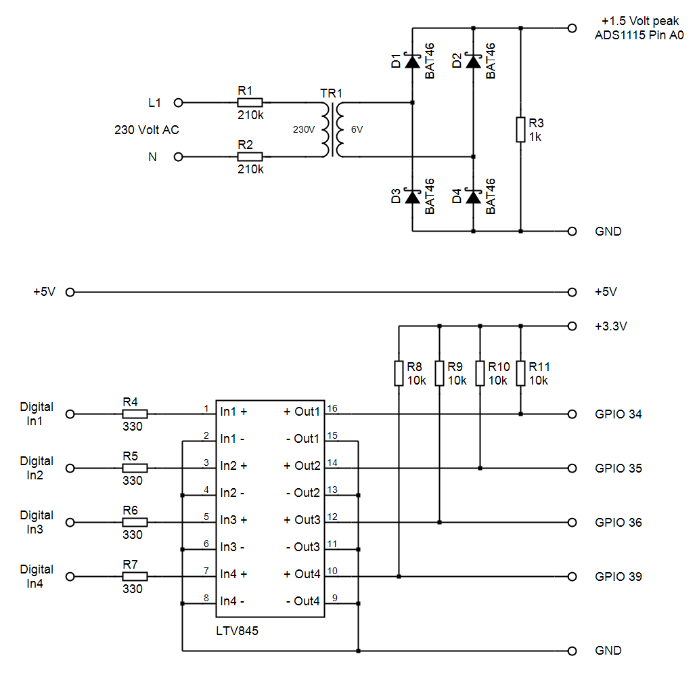

# envObserver
ESP32 based environment monitor
#### Features
* uses W5500 PHY/MAC for 100Base-T ethernet
* uses ADS1115 16Bit ADC with transformer and rectifier
* measures peak voltage, rms voltage and frequency
* uses BME280 as environment sensor
* uses LTV845 optocoupler for the digital inputs
* simple HTTP polling interface
#### GPIO
* GPIO 23 - W5500 MOSI
* GPIO 19 - W5500 MISO
* GPIO 18 - W5500 CLK
* GPIO  5 - W5500 CS
* GPIO 26 - W5500 INT
* GPIO 27 - W5500 RST
* GPIO 21 - ADS115 SDA
* GPIO 22 - ADS115 SCL
* GPIO 25 - ADS115 ALRT
* GPIO 17 - BME280 SDA
* GPIO 16 - BME280 SCL
* GPIO 34 - LTV845 Input 0
* GPIO 35 - LTV845 Input 1
* GPIO 36 - LTV845 Input 2
* GPIO 39 - LTV845 Input 3
#### Schematic

