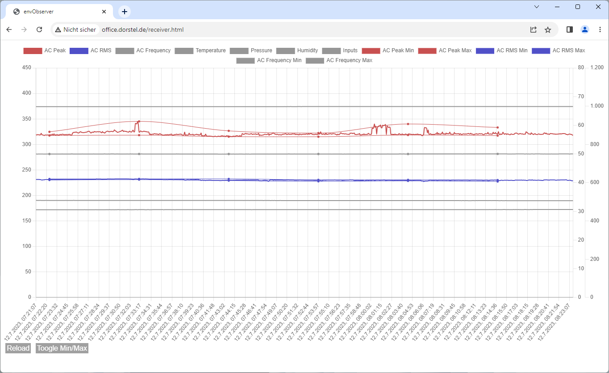

# envObserver
ESP32 based environment monitor
#### Features
* uses W5500 PHY/MAC for 100Base-T ethernet
* uses ADS1115 16Bit ADC with transformer and rectifier
* measures peak voltage, rms voltage and frequency
* uses BME280 as environment sensor
* uses LTV845 optocoupler for the digital inputs
* simple HTTP polling interface
#### GPIO W5500 (SPI)
* GPIO 23 - MOSI
* GPIO 19 - MISO
* GPIO 18 - CLK
* GPIO  5 - CS
* GPIO 26 - INT
* GPIO 27 - RST
#### GPIO ADS1115 (I2C)
* GPIO 21 - SDA
* GPIO 22 - SCL
* GPIO 25 - ALRT
#### GPIO BME280 (I2C)
* GPIO 17 - SDA
* GPIO 16 - SCL
#### GPIO LTV845
* GPIO 34 - Input 0
* GPIO 35 - Input 1
* GPIO 36 - Input 2
* GPIO 39 - Input 3
#### Development Hardware

#### Schematic

#### Web UI

